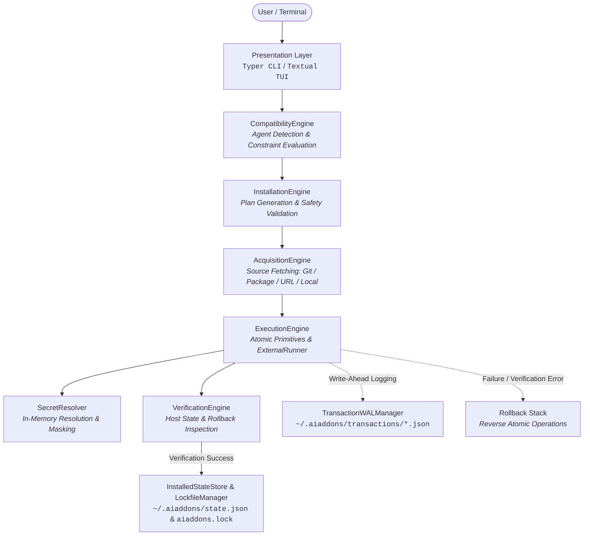

# AI Add-ons Manager (`aiaddons`)

> **Declarative, security-hardened, transactional package manager for AI coding agents.**

[](https://www.python.org/downloads/)
[]()
[]()
[](https://github.com/astral-sh/ruff)
[](pyproject.toml)

---

## What is `aiaddons`?

**`aiaddons`** is an open-source, declarative package and integration manager designed specifically for AI coding agents, including **Anthropic Claude Code** and **OpenAI Codex**. Just as `pip` manages Python dependencies and `npm` manages Node packages, `aiaddons` automates the discovery, compatibility evaluation, acquisition, configuration injection, verification, and lifecycle management of tools and extensions that AI agents require.

Modern AI coding agents rely on a growing ecosystem of external capabilities. `aiaddons` standardizes these extensions into four first-class integration primitives:

* **Model Context Protocol (MCP) Servers**: Standardized tools and data connectors (e.g. GitHub, PostgreSQL, Brave Search) configured dynamically via `npx`, `uvx`, `node`, or `python` runtimes.
* **Agent Skills**: Prompt templates, specialized instructions, and reusable workflow bundles (centered around `SKILL.md` specifications) deployed directly to agent skill paths.
* **Composite Plugins**: Multi-component packages combining MCP servers, skills, and CLI tools under unified configuration boundaries.
* **CLI Tools**: Verified external system binaries and developer utilities required by agents.

`aiaddons` supports dual-scope installation: **Global** (`~/.claude.json`, `~/.codex/`) for user-wide agent availability, and **Workspace** (`.claude.json`, `.agents/`, `aiaddons.lock`) for team-level, reproducible project environments checked into source control.

---

## Why It's Safe

Registry manifests describe **WHAT** an add-on is; trusted application code determines **HOW** it is installed. `aiaddons` enforces a defense-in-depth security model to eliminate supply-chain and execution vulnerabilities:

| Security Mechanism | Implementation in Codebase | Security Guarantee |
| :--- | :--- | :--- |
| **No Arbitrary Shell Execution** | `ExternalRunner` (`subprocess.Popen(shell=False)`) | Subprocess execution uses strictly typed argument vectors (`list[str]`). Shell interpreters (`bash -c`, `cmd.exe /c`, `powershell`) and arbitrary execution scripts in manifests are prohibited. |
| **Runtime & Binary Allowlist** | `ALLOWED_RUNTIMES`, `ALLOWED_EXECUTABLES`, `validate_runtime_name` | Only pre-approved runtime binaries (`npx`, `uvx`, `pip`, `npm`, `git`, `python`, `node`) resolved dynamically via `shutil.which` are permitted. |
| **Argument & Parameter Sanitization** | `validate_argument_vector`, `validate_mcp_package_name`, `FORBIDDEN_SHELL_PATTERNS` | Rejects shell metacharacters (`;`, `&&`, `\|\|`, `\|`, `>`, `<`, `$`, `` ` ``), forbidden evaluation flags (`--eval`, `-e`, `-c`, `--exec`), null bytes (`\0`), and malformed package identifiers. |
| **Boundary Confinement & Traversal Protection** | `verify_safe_target_path`, `validate_safe_relative_path`, `verify_path_security` | Confines all disk writes within designated `target_root` directories. Prohibits parent traversal (`..`), absolute path overrides, Windows drive letters, UNC shares (`\\server\share`), URL-encoded paths (`%2e%2e`), and escaping symlinks. |
| **Write-Ahead Log (WAL) & Rollbacks** | `TransactionWALManager`, `ExecutionEngine._rollback_executed_stack` | Every installation transitions through durable WAL phases (`REQUESTED` → `PLANNED` → `EXECUTING` → `VERIFIED` → `COMMITTED`). Failures trigger an atomic `RollbackAction` stack. Interrupted transactions are automatically detected and recovered. |
| **In-Memory Secret Protection** | `SecretResolver`, `mask_secrets_in_text`, `validate_env_var_name` | Manifests declare secret requirements (`secret: true`) without storing plaintext values. Secrets are resolved in-memory via `getpass` prompts or environment variables, masked as `***MASKED***` across logs and output, and blocked from restricted variables (`LD_PRELOAD`, `PYTHONPATH`, `PATH`). |
| **Post-Install Verification** | `VerificationEngine.verify_plan`, `verify_rollback` | Independent observer verifies that files, hashes (`sha256:`), and JSON/YAML configuration entries match expected values before committing transactions. |
| **Atomic Persistence** | `_atomic_write_file` (with `os.fsync` and atomic tempfile replacement) | Guarantees that local state database (`~/.aiaddons/state.json`) and workspace lockfiles (`aiaddons.lock`) cannot be corrupted by abrupt terminations or disk errors. |

---

## Architecture

`aiaddons` is designed with a decoupled, domain-driven core where presentation layers (CLI & TUI) delegate directly to verified business engines:



### Core Components

* **`CompatibilityEngine`**: Evaluates target agent support, scope constraints, agent capabilities (`mcp`, `skill`), host OS matching, and CLI prerequisites.
* **`InstallationEngine`**: Generates immutable `InstallationPlan` structures containing declarative, typed operations (`CreateDirectoryOperation`, `WriteFileOperation`, `ModifyJsonOperation`, `AddMcpServerOperation`, `AddSkillOperation`, etc.).
* **`AcquisitionEngine`**: Coordinates source acquisition into isolated staging environments (`~/.aiaddons/staging/`) with cryptographic checksum verification (`sha256:`).
* **`ExecutionEngine`**: Executes atomic file primitives and external package managers with timeout controls, strict argument vectors, and rollback tracking.
* **`VerificationEngine`**: Inspects resulting filesystem artifacts and agent configuration files, guaranteeing state integrity prior to commit.
* **`InstalledStateStore` & `LockfileManager`**: Tracks installed add-ons globally (`state.json`) and per-workspace (`aiaddons.lock`).
* **`TransactionWALManager`**: Persists durable transaction records for crash recovery and auditability.

---

## Installation

### Prerequisites

* **Python**: `3.11` or higher
* **Target AI Coding Agent** (at least one installed):
  * [Claude Code](https://docs.anthropic.com/en/docs/agents-and-tools/claude-code/overview) (`claude`)
  * [OpenAI Codex](https://github.com/openai/codex) (`codex`)
* **Optional Runtime Binaries**: `git`, `npx` / `node`, `uvx` / `python`, `pip`

### Install from Source

```bash
# Clone repository
git clone https://github.com/Anuj04432/AI-Add-ons-Manager.git
cd AI-Add-ons-Manager

# Standard editable install via pip
pip install -e .

# Or using uv (recommended for ultra-fast setup)
uv pip install -e .

# For development dependencies (pytest, mypy, ruff)
pip install -e ".[dev]"
```

Verify your installation:

```bash
aiaddons --version
aiaddons agents
```

---

## Quickstart

A complete end-to-end walkthrough using verified commands:

```bash
# 1. Search the registry for available add-ons
aiaddons search mcp

# 2. Inspect metadata and required configuration for an add-on
aiaddons info github-mcp

# 3. Check compatibility against detected AI coding agents (read-only)
aiaddons check github-mcp --scope workspace

# 4. Preview installation steps with zero system modifications
aiaddons install github-mcp --dry-run

# 5. Perform the installation (prompts for confirmation and required secrets)
aiaddons install github-mcp --scope workspace

# 6. Check detected AI agents and their registered configuration paths
aiaddons agents

# 7. Run comprehensive system diagnostics and health checks
aiaddons doctor

# 8. Launch the interactive Textual terminal UI
aiaddons tui
```

---

## CLI Reference

All commands support `--help` for option descriptions.

| Command | Description | Key Options |
| :--- | :--- | :--- |
| `aiaddons list` | List available add-ons in the registry. | `--type`, `--category`, `--agent`, `--json`, `--registry-dir` |
| `aiaddons search <query>` | Search add-ons by keyword, tag, ID, or description. | `--json`, `--registry-dir` |
| `aiaddons info <addon-id>` | Display detailed manifest metadata, publisher trust, and dependencies. | `--json`, `--registry-dir` |
| `aiaddons check <addon-id>` | Evaluate add-on compatibility against detected AI agents in read-only mode. | `--scope` (`global` \| `workspace`), `--json`, `--registry-dir` |
| `aiaddons install <addon-id>` | Install an add-on or generate a dry-run installation plan. | `--scope`, `--agent`, `--dry-run`, `--yes`, `--json`, `--registry` |
| `aiaddons agents` | Detect and display status, version, and config paths for local AI agents. | `--json`, `--project-path` |
| `aiaddons doctor` | Run comprehensive diagnostics across registry, state, lockfile, WAL, and runtimes. | `--json`, `--project-path` |
| `aiaddons tui` | Launch the interactive Textual terminal user interface. | `--registry` |
| `aiaddons version` | Print the current `aiaddons` version. | `--version` / `-v` |
| `aiaddons registry update` | Fetch and validate fresh registry metadata from remote HTTPS endpoint. | `--url`, `--cache-dir` |
| `aiaddons registry status` | Display cache health, last sync timestamp, and total cached manifests. | `--url`, `--cache-dir`, `--json` |
| `aiaddons registry list` | List cached add-ons (subcommand alias). | `--type`, `--category`, `--agent`, `--json` |
| `aiaddons registry search <query>` | Search cached add-ons (subcommand alias). | `--json` |
| `aiaddons registry info <addon-id>` | Inspect cached add-on details (subcommand alias). | `--json` |

---

## Authoring a Manifest

Add-ons are authored declaratively as YAML or JSON files conforming to the strict Pydantic `IntegrationManifest` schema (`extra = "forbid"`).

### Minimal MCP Server Manifest (`github-mcp.yaml`)

```yaml
id: github-mcp
name: GitHub MCP Server
version: 1.2.0
description: Model Context Protocol server for searching code, managing PRs, and inspecting issues.
documentation_url: https://github.com/modelcontextprotocol/servers
license: MIT
category: developer-tools
integration_type: mcp
target_agents:
  - claude-code
  - codex
supported_scopes:
  - global
  - workspace
source:
  source_type: package
  package_name: "@modelcontextprotocol/server-github"
  checksum: "sha256:e3b0c44298fc1c149afbf4c8996fb92427ae41e4649b934ca495991b7852b855"
dependencies:
  - name: npx
    type: cli
    required: true
trust:
  verification_status: verified
  publisher:
    name: Model Context Protocol Team
    url: https://github.com/modelcontextprotocol
    declared_verified: true
  allowed_executables:
    - npx
tags:
  - github
  - mcp
  - git
handler_spec:
  mcp:
    transport: stdio
    runtime: npx
    package_name: "@modelcontextprotocol/server-github"
    env_vars:
      - name: GITHUB_PERSONAL_ACCESS_TOKEN
        required: true
        secret: true
        description: GitHub Personal Access Token with repository scope
```

### Minimal Agent Skill Manifest (`refactoring-skill.yaml`)

```yaml
id: refactoring-skill
name: Automated Code Refactoring Skill
version: 0.8.1
description: Standardized refactoring patterns and clean architecture workflows for coding agents.
documentation_url: https://aiaddons.dev/skills/refactoring
license: Apache-2.0
category: workflow
integration_type: skill
target_agents:
  - claude-code
supported_scopes:
  - workspace
source:
  source_type: git
  repository: https://github.com/aiaddons/refactoring-skill
  ref: v0.8.1
  commit_sha: 4a2d8f9e1c3b5a7d9e0f2a4b6c8d0e1f2a3b4c5d
dependencies: []
trust:
  verification_status: community
  publisher:
    name: Community Developers
    declared_verified: false
tags:
  - refactoring
  - skill
  - clean-code
handler_spec:
  skill:
    skill_file: SKILL.md
    supporting_files: []
```

---

## Project Status

`aiaddons` has completed **Phase 6** of core development. The foundational engines, agent adapters, security layers, transactional installer, post-install verifier, CLI, TUI, remote registry sync, and diagnostics are fully operational.

### Test Suite Status

```text
=========================== test session starts ============================
platform win32 -- Python 3.12.3, pytest-9.1.1, pluggy-1.5.0
rootdir: C:\Users\Anuj Kumar\Desktop\add_ons
configfile: pyproject.toml
testpaths: tests
collected 303 items

299 passed, 4 skipped in 99.40s
=========================== lint & typecheck ===============================
Ruff Linter: All checks passed!
Mypy Strict: Success: no issues found in 77 source files
```

*(Note: 4 unit tests skipped conditionally on Windows due to symlink creation privileges without Developer Mode).*

### Roadmap

* [ ] **Automated Removal Command**: `aiaddons remove <addon-id>` with inverse verification.
* [ ] **Add-on Updates & Upgrades**: `aiaddons update [--all]` for checking and applying newer manifest versions.
* [ ] **Workspace Sync**: `aiaddons sync` to restore all add-ons declared in `aiaddons.lock`.
* [ ] **Manifest Publishing Workflow**: `aiaddons publish` for validating, hashing, and submitting manifests to signed remote registries.
* [ ] **Additional Agent Adapters**: Official adapter support for Cursor, Windsurf, Gemini CLI, and Aider.
* [ ] **Sandboxed MCP Execution**: Containerized / WebAssembly runtime environments for isolated MCP server execution.

---

## Contributing

Contributions are welcome! Please ensure that any changes adhere to our engineering rules and architectural standards (see `AGENTS.md`):

1. **Keep presentation decoupled**: Core domain models and engines (`core/`) must never import UI code (`cli/`, `tui/`).
2. **Never hardcode add-ons**: Integrations must be strictly registry-driven.
3. **Ensure full typing and test coverage**:
   ```bash
   # Run tests
   pytest

   # Run type checks
   mypy src

   # Run linter
   ruff check src tests
   ```

---

## License

This project is licensed under the **MIT License**. See [`pyproject.toml`](pyproject.toml) for details.
