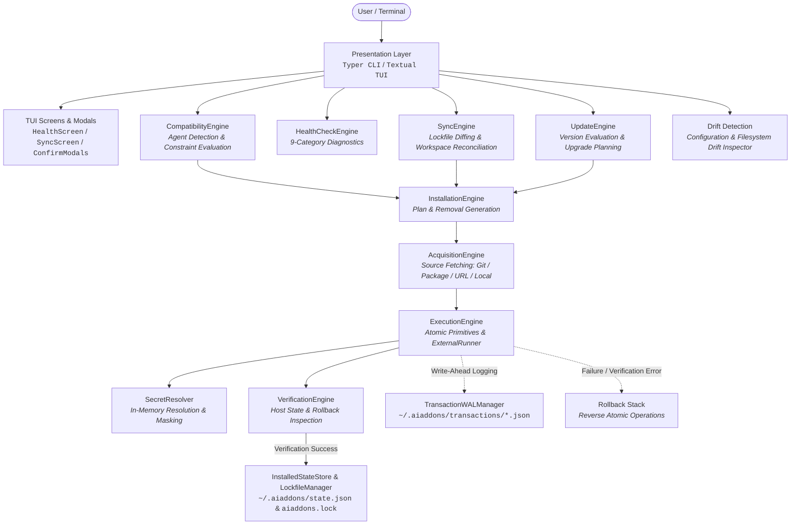

# AI Add-ons Manager (`aiaddons`)

> **Declarative, security-hardened, transactional package manager for AI coding agents.**

[](https://www.python.org/downloads/)
[]()
[]()
[](https://github.com/astral-sh/ruff)
[](pyproject.toml)

---

## What is `aiaddons`?

**`aiaddons`** is an open-source, declarative package and integration manager designed specifically for AI coding agents, including **Anthropic Claude Code**, **OpenAI Codex**, **Antigravity CLI**, **Cursor**, and **Hermes Agent**. Just as `pip` manages Python dependencies and `npm` manages Node packages, `aiaddons` automates the discovery, compatibility evaluation, acquisition, configuration injection, verification, and lifecycle management of tools and extensions that AI agents require.

Modern AI coding agents rely on a growing ecosystem of external capabilities. `aiaddons` standardizes these extensions into four first-class integration primitives:

* **Model Context Protocol (MCP) Servers**: Standardized tools and data connectors (e.g. GitHub, PostgreSQL, Brave Search) configured dynamically via `npx`, `uvx`, `node`, or `python` runtimes.
* **Agent Skills**: Prompt templates, specialized instructions, and reusable workflow bundles (centered around `SKILL.md` specifications) deployed directly to agent skill paths.
* **Composite Plugins**: Multi-component packages combining MCP servers, skills, and CLI tools under unified configuration boundaries.
* **CLI Tools**: Verified external system binaries and developer utilities required by agents.

`aiaddons` supports dual-scope installation: **Global** (`~/.claude.json`, `~/.codex/`, `~/.gemini/config/mcp_config.json`, `~/.cursor/mcp.json`, `~/.hermes/config.yaml`) for user-wide agent availability, and **Workspace** (`.claude.json`, `.agents/`, `.cursor/`, `aiaddons.lock`) for team-level, reproducible project environments checked into source control.

---

## Why It's Safe

Registry manifests describe **WHAT** an add-on is; trusted application code determines **HOW** it is installed, updated, or removed. `aiaddons` enforces a defense-in-depth security model to eliminate supply-chain and execution vulnerabilities:

| Security Mechanism | Implementation in Codebase | Security Guarantee |
| :--- | :--- | :--- |
| **No Arbitrary Shell Execution** | `ExternalRunner` (`subprocess.Popen(shell=False)`) | Subprocess execution uses strictly typed argument vectors (`list[str]`). Shell interpreters (`bash -c`, `cmd.exe /c`, `powershell`) and arbitrary execution scripts in manifests are prohibited. |
| **Runtime & Binary Allowlist** | `ALLOWED_RUNTIMES`, `ALLOWED_EXECUTABLES`, `validate_runtime_name` | Only pre-approved runtime binaries (`npx`, `uvx`, `pip`, `npm`, `git`, `python`, `node`) resolved dynamically via `shutil.which` are permitted. |
| **Argument & Parameter Sanitization** | `validate_argument_vector`, `validate_mcp_package_name`, `FORBIDDEN_SHELL_PATTERNS` | Rejects shell metacharacters (`;`, `&&`, `\|\|`, `\|`, `>`, `<`, `$`, `` ` ``), forbidden evaluation flags (`--eval`, `-e`, `-c`, `--exec`), null bytes (`\0`), and malformed package identifiers. |
| **Boundary Confinement & Traversal Protection** | `verify_safe_target_path`, `validate_safe_relative_path`, `verify_path_security` | Confines all disk writes within designated `target_root` directories. Prohibits parent traversal (`..`), absolute path overrides, Windows drive letters, UNC shares (`\\server\share`), URL-encoded paths (`%2e%2e`), and escaping symlinks. |
| **Write-Ahead Log (WAL) & Rollbacks** | `TransactionWALManager`, `ExecutionEngine._rollback_executed_stack` | Every installation, update, and removal transitions through durable WAL phases (`REQUESTED` → `PLANNED` → `EXECUTING` → `VERIFIED` → `COMMITTED`). Failures trigger an atomic `RollbackAction` stack. Interrupted transactions are automatically detected and recovered. |
| **In-Memory Secret Protection** | `SecretResolver`, `mask_secrets_in_text`, `validate_env_var_name` | Manifests declare secret requirements (`secret: true`) without storing plaintext values. Secrets are resolved in-memory via `getpass` prompts or environment variables, masked as `***MASKED***` across logs and output, and blocked from restricted variables (`LD_PRELOAD`, `PYTHONPATH`, `PATH`). Features soft warnings on malformed secrets, masked preview after entry, and live asterisk feedback on Windows. |
| **Configuration Drift Detection** | `detect_installation_drift` | Compares live agent configuration files and filesystem contents against recorded states to warn before mutating or removing modified integrations. |
| **Post-Operation Verification** | `VerificationEngine.verify_plan`, `verify_rollback` | Independent observer verifies that files, hashes (`sha256:`), and JSON/YAML configuration entries match expected values before committing transactions. |
| **Atomic Persistence** | `_atomic_write_file` (with `os.fsync` and atomic tempfile replacement) | Guarantees that local state database (`~/.aiaddons/state.json`) and workspace lockfiles (`aiaddons.lock`) cannot be corrupted by abrupt terminations or disk errors. |

---

## Architecture

`aiaddons` is designed with a decoupled, domain-driven core where presentation layers (CLI & TUI) delegate directly to verified business engines:



### Core Components

* **`CompatibilityEngine`**: Evaluates target agent support, scope constraints, agent capabilities (`mcp`, `skill`), host OS matching, and CLI prerequisites.
* **`InstallationEngine`**: Generates immutable `InstallationPlan` and removal plan structures containing declarative, typed operations (`CreateDirectoryOperation`, `WriteFileOperation`, `ModifyJsonOperation`, `AddMcpServerOperation`, `AddSkillOperation`, etc.).
* **`UpdateEngine`**: Evaluates newer manifest versions and coordinates transactional atomic updates and version swaps with rollback safety.
* **`SyncEngine`**: Computes declarative diffs between workspace lockfiles (`aiaddons.lock`) or stack files and local environments, orchestrating installs, updates, and prunes.
* **`HealthCheckEngine`**: Runs 9-category system diagnostics across CLI tools, agent configs, state stores, lockfiles, WAL transactions, and disk security.
* **`Drift Detection`**: Detects external tampering or manual edits to agent configuration files or installed assets before removals and updates.
* **`AcquisitionEngine`**: Coordinates source acquisition into isolated staging environments (`~/.aiaddons/staging/`) with cryptographic checksum verification (`sha256:`).
* **`ExecutionEngine`**: Executes atomic file primitives and external package managers with timeout controls, strict argument vectors, and rollback tracking.
* **`VerificationEngine`**: Inspects resulting filesystem artifacts and agent configuration files, guaranteeing state integrity prior to commit.
* **`InstalledStateStore` & `LockfileManager`**: Tracks installed add-ons globally (`state.json`) and per-workspace (`aiaddons.lock`).
* **`TransactionWALManager`**: Persists durable transaction records for crash recovery and auditability.

---

## Installation

### Prerequisites

* **Python**: `3.11` or higher
* **Target AI Coding Agent** (at least one installed):
  * [Claude Code](https://docs.anthropic.com/en/docs/agents-and-tools/claude-code/overview) (`claude`)
  * [OpenAI Codex](https://github.com/openai/codex) (`codex`)
  * Antigravity CLI (`agy` / `antigravity`)
  * [Cursor](https://www.cursor.com) (`cursor`)
  * [Hermes Agent](https://github.com/NousResearch/Hermes-Agent) (`hermes`)
* **Optional Runtime Binaries**: `git`, `npx` / `node`, `uvx` / `python`, `pip`

### Install from Source

```bash
# Clone repository
git clone https://github.com/Anuj04432/AI-Add-ons-Manager.git
cd AI-Add-ons-Manager

# Standard editable install via pip
pip install -e .

# Or using uv (recommended for ultra-fast setup)
uv pip install -e .

# For development dependencies (pytest, mypy, ruff)
pip install -e ".[dev]"
```

Verify your installation:

```bash
aiaddons --version
aiaddons agents
```

---

## Quickstart

### 1. Batch Install Add-ons (Core Value Proposition)

Install multiple MCP servers, skills, and plugins across your workspace in a single transactional command:

```bash
# Install multiple add-ons at once for detected agents
aiaddons install github-mcp postgres-mcp code-reviewer caveman --scope workspace

# Or declare your entire team stack in a YAML/JSON file and install it in one step:
aiaddons install --file team-stack.yaml
```

> [!TIP]
> **Configuring Required Secrets (API Keys & Tokens)**
> 
> When installing add-ons that require credentials (such as `GITHUB_TOKEN` for `github-mcp`), `aiaddons` prompts for masked, no-echo terminal input.
> - **Windows Paste Support**: Supports pasting tokens via <kbd>Ctrl</kbd>+<kbd>V</kbd> into masked password prompts on Windows PowerShell, CMD, and Windows Terminal.
> - **Environment Variable Alternative**: You can also pre-set secrets in your shell environment before running `install` (especially convenient for long tokens or automated CI runs):
>   - **Windows PowerShell**: `$env:GITHUB_TOKEN = "ghp_your_token_value"`
>   - **Linux / macOS (Bash/Zsh)**: `export GITHUB_TOKEN="ghp_your_token_value"`
>   - **Windows CMD**: `set GITHUB_TOKEN=ghp_your_token_value`

### 2. Workspace Lockfile Synchronization

When cloning a repository with an existing `aiaddons.lock`, synchronize your agent environment with zero manual configuration:

```bash
# Fresh clone bootstrap: installs all declared add-ons automatically
aiaddons sync

# Reconcile local environment: install missing, update mismatched, and prune extra add-ons
aiaddons sync --prune --update
```

> [!NOTE]
> **Committing `aiaddons.lock`**
> End users of `aiaddons` are encouraged to commit `aiaddons.lock` to their own project's version control to guarantee a reproducible team stack of AI agent capabilities. However, if you are developing or testing `aiaddons` *itself* (i.e., within this repository), `aiaddons.lock` is explicitly `.gitignore`d to prevent local test fixtures and experimental installations from polluting the main project history.

### 3. Update & Version Upgrades

Keep your AI agent capabilities up to date with automated SemVer checks and atomic rollback safety:

```bash
# Update all installed add-ons with newer registry versions available
aiaddons update --all

# Or update a specific add-on to a target version
aiaddons update github-mcp --version 1.3.0
```

### 4. Search, Inspect & Evaluate Compatibility

```bash
# Search available add-ons
aiaddons search mcp

# Inspect metadata and configuration requirements
aiaddons info github-mcp

# Check compatibility against detected local AI agents (read-only)
aiaddons check github-mcp --scope workspace

# Preview installation operations without applying changes
aiaddons install github-mcp --dry-run
```

### 5. Diagnostics & Interactive TUI

```bash
# Run 9-category system diagnostics and health checks
aiaddons doctor

# Launch the interactive terminal user interface
aiaddons tui
```

---


## Registry & Available Add-ons

The built-in registry currently provides **30 integrations** out of the box, covering a wide spectrum of tools for AI agents. Since the last major update, the registry has been expanded significantly:

* **Newly Added MCP Servers**: `stripe-mcp`, `sentry-mcp`, `supabase-mcp`, `firecrawl-mcp`, `sequential-thinking-mcp`, `notion-mcp`, `figma-mcp`, `github-mcp`, `postgres-mcp`, `brave-search-mcp`, `filesystem-mcp`, `playwright-mcp`, `context7-mcp`
* **Agent Skills**: Dozens of workflow skills including `caveman`, `ponytail-audit-skill`, and other behavioral tools.

Additionally, `aiaddons` includes **2 pre-configured stacks** (`dev-starter-stack.yaml`, `agent-behavior-stack.yaml`) in `registry/stacks/` to help quickly bootstrap a team environment.

## Interactive Terminal UI (TUI)

`aiaddons` provides a rich, responsive Textual-powered terminal user interface accessible via `aiaddons tui`.

```text
 ┌─────────────────────────┬────────────────────────────────────────────────────────┐
 │ Add-ons Registry        │ GitHub MCP Server (v1.2.0)                             │
 │ 🔍 [Search...         ] │ Model Context Protocol server for searching code...    │
 │                         │                                                        │
 │ ◉ github-mcp     [MCP]  │ Status: ✓ Installed (Workspace)                        │
 │ ○ postgres-mcp   [MCP]  │ Agent:  Claude Code                                    │
 │ ○ code-reviewer  [SKILL]│                                                        │
 │ ○ refactor-skill [SKILL]│ [H] Health  [S] Sync  [I] Install  [R] Remove  [U] Upd │
 └─────────────────────────┴────────────────────────────────────────────────────────┘
```

### TUI Keybindings & Controls

| Key | Action | Description |
| :--- | :--- | :--- |
| <kbd>H</kbd> | **Health Check** | Opens **`HealthScreen`** to run and view real-time diagnostics across all 9 categories. |
| <kbd>S</kbd> | **Sync Workspace** | Opens **`SyncScreen`** to inspect `aiaddons.lock` diffs (missing, extra, mismatched) and reconcile. |
| <kbd>I</kbd> | **Install** | Installs selected add-on with interactive secret inputs and transactional commit. |
| <kbd>R</kbd> | **Remove** | Opens **`RemoveConfirmModal`** or **`DriftConfirmModal`** (if files were modified) to safely uninstall. |
| <kbd>U</kbd> | **Update** | Checks for newer versions and opens **`UpdatePlanModal`** for version-swap previews. |
| <kbd>C</kbd> | **Check Compat** | Evaluates compatibility in read-only mode and displays requirement details. |
| <kbd>P</kbd> | **Preview Plan** | Generates a dry-run plan showing exact operations without changing system state. |
| <kbd>Q</kbd> | **Quit** | Exits the TUI application. |

> [!NOTE]
> **Same Engine, Same Safety**: The TUI is a direct presentation wrapper around the exact same domain engines (`ExecutionEngine`, `TransactionWALManager`, `VerificationEngine`, `LockfileManager`) as the CLI. Every installation, update, and removal in the TUI includes full WAL crash safety, file locking, drift detection, secret masking, and automatic rollback on failure.

---

## CLI Reference

All commands support `--help` for option descriptions.

| Command | Description | Key Options |
| :--- | :--- | :--- |
| `aiaddons install [addon-ids...]` | Install one or more add-ons or generate a dry-run installation plan. | `--file` / `-f`, `--scope` / `-s`, `--agent` / `-a`, `--dry-run`, `--yes` / `-y`, `--json` / `-j`, `--registry` / `-r` |
| `aiaddons remove <addon-id>` | Remove an installed add-on with safety verification and rollback. | `--scope` / `-s`, `--agent` / `-a`, `--dry-run`, `--yes` / `-y`, `--force` / `-f`, `--json` / `-j`, `--registry` / `-r` |
| `aiaddons update [addon-id]` | Update installed add-on(s) with newer versions and rollback safety. | `--version` / `-v`, `--all` / `-A`, `--scope` / `-s`, `--agent` / `-a`, `--dry-run`, `--yes` / `-y`, `--json` / `-j`, `--registry` / `-r` |
| `aiaddons sync` | Synchronize workspace with `aiaddons.lock` or stack file. | `--file` / `-f`, `--scope` / `-s`, `--agent` / `-a`, `--prune`, `--update`, `--dry-run`, `--yes` / `-y`, `--json` / `-j`, `--registry` / `-r` |
| `aiaddons list` | List available add-ons in the registry. | `--type`, `--category`, `--agent`, `--json`, `--registry-dir` |
| `aiaddons search <query>` | Search add-ons by keyword, tag, ID, or description. | `--json`, `--registry-dir` |
| `aiaddons info <addon-id>` | Display detailed manifest metadata, publisher trust, and dependencies. | `--json`, `--registry-dir` |
| `aiaddons check <addon-id>` | Evaluate add-on compatibility against detected AI agents in read-only mode. | `--scope` (`global` \| `workspace`), `--agent`, `--json`, `--registry-dir` |
| `aiaddons agents` | Detect and display status, version, and config paths for local AI agents. | `--json`, `--project-path` |
| `aiaddons doctor` | Run comprehensive diagnostics across registry, state, lockfile, WAL, and runtimes. | `--json`, `--project-path` |
| `aiaddons tui` | Launch the interactive Textual terminal user interface. | `--registry` / `-r` |
| `aiaddons version` | Print the current `aiaddons` version. | `--version` / `-v` |
| `aiaddons registry update` | Fetch and validate fresh registry metadata from remote HTTPS endpoint. | `--url`, `--cache-dir` |
| `aiaddons registry status` | Display cache health, last sync timestamp, and total cached manifests. | `--url`, `--cache-dir`, `--json` |
| `aiaddons registry list` | List cached add-ons (subcommand alias). | `--type`, `--category`, `--agent`, `--json` |
| `aiaddons registry search <query>` | Search cached add-ons (subcommand alias). | `--json` |
| `aiaddons registry info <addon-id>` | Inspect cached add-on details (subcommand alias). | `--json` |

---

## Authoring a Manifest

Add-ons are authored declaratively as YAML or JSON files conforming to the strict Pydantic `IntegrationManifest` schema (`extra = "forbid"`).

### Minimal MCP Server Manifest (`github-mcp.yaml`)

```yaml
id: github-mcp
name: GitHub MCP Server
version: 1.2.0
description: Model Context Protocol server for searching code, managing PRs, and inspecting issues.
documentation_url: https://github.com/modelcontextprotocol/servers
license: MIT
category: developer-tools
integration_type: mcp
target_agents:
  - claude-code
  - codex
supported_scopes:
  - global
  - workspace
source:
  source_type: package
  package_name: "@modelcontextprotocol/server-github"
  checksum: "sha256:e3b0c44298fc1c149afbf4c8996fb92427ae41e4649b934ca495991b7852b855"
dependencies:
  - name: npx
    type: cli
    required: true
trust:
  verification_status: verified
  publisher:
    name: Model Context Protocol Team
    url: https://github.com/modelcontextprotocol
    declared_verified: true
  allowed_executables:
    - npx
tags:
  - github
  - mcp
  - git
handler_spec:
  mcp:
    transport: stdio
    runtime: npx
    package_name: "@modelcontextprotocol/server-github"
    env_vars:
      - name: GITHUB_PERSONAL_ACCESS_TOKEN
        required: true
        secret: true
        description: GitHub Personal Access Token with repository scope
```

### Minimal Agent Skill Manifest (`caveman.yaml`)

```yaml
id: caveman
name: Caveman Output Compression Skill
version: 0.8.1
description: Standardized refactoring patterns and clean architecture workflows for coding agents.
documentation_url: https://aiaddons.dev/skills/refactoring
license: Apache-2.0
category: workflow
integration_type: skill
target_agents:
  - claude-code
supported_scopes:
  - workspace
source:
  source_type: git
  url: https://github.com/JuliusBrussee/caveman.git
  ref: v0.8.1
  commit_sha: 4a2d8f9e1c3b5a7d9e0f2a4b6c8d0e1f2a3b4c5d
dependencies: []
trust:
  verification_status: community
  publisher:
    name: Community Developers
    declared_verified: false
tags:
  - refactoring
  - skill
  - clean-code
handler_spec:
  skill:
    skill_file: SKILL.md
    supporting_files: []
```

---


## Hardening & Reliability

As part of the project's evolution, `aiaddons` underwent a dedicated manual QA pass that identified and resolved real-world edge cases not caught by automated testing. This quality investment resulted in significant improvements to transactional safety—particularly around MCP server installation (preventing daemon-process hangs during failed installations), secret resolution correctness fixes across different terminal environments, and robust cross-platform input handling. Manual QA and real-world hardening remain integral parts of the project's ongoing quality lifecycle.

## Project Status

`aiaddons` has achieved the complete **v1.0 Milestone**. All core package manager workflows—declarative installation, batch stack files, transactional removal with drift detection, automated updates with version swapping, workspace lockfile synchronization, 9-category system diagnostics, and an interactive Textual TUI—are fully operational and tested.

### Test Suite Status

```text
=========================== test session starts ============================
platform win32 -- Python 3.12.13, pytest-9.1.1, pluggy-1.5.0
rootdir: C:\Users\Anuj Kumar\Desktop\add_ons
configfile: pyproject.toml
testpaths: tests
collected 505 items

501 passed, 4 skipped in 46.36s
=========================== lint & typecheck ===============================
Ruff Linter: All checks passed!
Mypy Strict: Checked 93 source files
```

*(Note: 4 unit tests skipped conditionally on Windows due to symlink creation privileges without Developer Mode).*

*(Note: Manual QA is actively incorporated into the project's ongoing quality and release process to ensure real-world reliability beyond automated testing).*

### Completed (v1.0 Milestone)

* [x] **Declarative Installation & Batch Stacks**: Single and multi-package installs (`aiaddons install <ids...>`) and `--file stack.yaml` with WAL rollback protection.
* [x] **Safe Transactional Removal**: `aiaddons remove <addon-id>` with configuration drift detection and inverse verification.
* [x] **Add-on Updates & Version Swapping**: `aiaddons update [--all]` with SemVer resolution and atomic transaction rollback.
* [x] **Workspace Sync**: `aiaddons sync [--prune] [--update]` restoring and reconciling `aiaddons.lock`.
* [x] **Interactive Textual TUI**: Add-on browser, `HealthScreen` diagnostics, `SyncScreen` reconciliation, drift/update modals, and toast notifications.
* [x] **System Diagnostics**: `aiaddons doctor` covering 9 critical health categories across runtimes, state, lockfile, and WAL.
* [x] **Remote Registry Synchronization**: `aiaddons registry update/status` with HTTP caching and fallback.

### Future Roadmap (v2.0)

* [ ] **Additional Agent Adapters**: Official adapter implementations for Cursor, Windsurf, Gemini CLI, and Aider.
* [ ] **Manifest Publishing & Cryptographic Signatures**: `aiaddons publish` for validating, signing, and submitting manifests to signed remote registries.
* [ ] **Sandboxed MCP Execution**: Containerized / WebAssembly runtime environments for isolated MCP server execution.

---

## Contributing

Contributions are welcome! Please ensure that any changes adhere to our engineering rules and architectural standards (see `AGENTS.md`):

1. **Keep presentation decoupled**: Core domain models and engines (`core/`) must never import UI code (`cli/`, `tui/`).
2. **Never hardcode add-ons**: Integrations must be strictly registry-driven.
3. **Ensure full typing and test coverage**:
   ```bash
   # Run tests
   pytest

   # Run type checks
   mypy src

   # Run linter
   ruff check src tests
   ```

---

## License

This project is licensed under the **MIT License**. See [`pyproject.toml`](pyproject.toml) for details.
