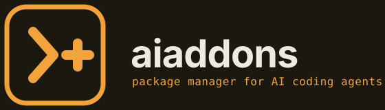

<p align="center">
  
</p>

<p align="center">
  <a href="https://pypi.org/project/aiaddons/"></a>
  <a href="https://pypi.org/project/aiaddons/"></a>
  <a href="LICENSE"></a>
</p>

Developers who want to use an MCP server, an agent skill, or a composite plugin with their AI coding agent currently have to configure everything by hand: hunt down the repository, decipher the target agent's config file path and format, manually edit JSON or YAML structures, handle tokens and credentials safely, and repeat all of this per agent when switching tools or working across multiple environments. `aiaddons` replaces manual configuration with a single command that installs, updates, removes, and synchronizes add-ons across whichever AI coding agents you use—transactionally, with full write-ahead rollback protection, and without touching config files by hand. Built to be the tool you reach for every time you want to add a new capability to your coding agent, the same way you'd reach for pip or npm.

## Quick demo

```text
$ aiaddons install github-mcp --dry-run

GitHub MCP Server
--------------------

Target:
  Claude Code
  Workspace

Plan:
  + Validate source
  + Prepare MCP configuration
  + Configure MCP server 'github-mcp' (@modelcontextprotocol/server-github) for Claude Code (workspace)
  + Inject key 'mcpServers.github-mcp' into agent configuration file '.claude.json'

No changes were made.
```

## Why aiaddons

- **Transactional installs with rollback**: Every operation is logged to a write-ahead log (WAL). If validation, fetching, or configuration injection encounters an error, the operation rolls back to the previous known state so configuration files are never left in a broken or half-installed condition.
- **Cross-agent from a single command**: Add integrations to Claude Code, OpenAI Codex, Antigravity CLI, Cursor, or Hermes Agent without remembering agent-specific file paths, schema keys, or formatting quirks.
- **Safe secrets and execution**: Manifests declare required variables without storing credentials. Secrets are collected in-memory with masked terminal input, and background processes execute strictly via typed argument vectors rather than arbitrary shell scripts.
- **Configuration drift detection**: Inspects existing agent configurations and filesystem state before modifying or removing add-ons, warning you if files were modified externally since installation.
- **Real verified registry**: Manifests are validated against live package registries and genuine Git commit SHAs, preventing broken installs from fabricated packages or non-existent commits.

## Installation

Install `aiaddons` from PyPI:

```bash
pip install aiaddons
```

You can also install `aiaddons` in an isolated environment using `pipx` or `uv`:

```bash
pipx install aiaddons
# or
uv tool install aiaddons
```

### Prerequisites

- Python 3.11 or higher
- At least one supported AI coding agent installed

## Supported agents

`aiaddons` detects and configures integrations across 5 AI coding agents:

| Agent | CLI / Binary | Supported scopes | Capabilities | Configuration target |
| :--- | :--- | :--- | :--- | :--- |
| **Claude Code** | `claude` | Global, Workspace | MCP, Skill | `~/.claude.json`, `.claude.json` |
| **OpenAI Codex** | `codex` | Global, Workspace | MCP, Skill | `~/.codex/`, `.agents/` |
| **Antigravity CLI** | `agy` / `antigravity` | Global, Workspace | MCP, Skill | `~/.gemini/config/mcp_config.json`, `.agents/mcp_config.json` |
| **Cursor** | `cursor` | Global, Workspace | MCP | `~/.cursor/mcp.json`, `.cursor/mcp.json` |
| **Hermes Agent** | `hermes` | Global | MCP, Skill | `~/.hermes/config.yaml` |

To inspect your locally installed agents and detected configuration files, run:

```bash
aiaddons agents
```

## Core commands

| Command | Description |
| :--- | :--- |
| `aiaddons install <addon...>` | Install one or more add-ons transactionally for detected agents. |
| `aiaddons remove <addon>` | Safely remove an installed add-on, checking for configuration drift. |
| `aiaddons update [addon]` | Update add-on(s) to newer versions with atomic rollback safety. |
| `aiaddons sync` | Reconcile workspace state against `aiaddons.lock` or a team stack file. |
| `aiaddons doctor` | Run system diagnostics across agent configurations, runtimes, and local state. |

<details>
<summary>Additional commands</summary>

| Command | Description |
| :--- | :--- |
| `aiaddons agents` | Detect and display status, version, and config paths for local AI agents. |
| `aiaddons list` | List available add-ons in the registry. |
| `aiaddons search <query>` | Search add-ons by keyword, tag, ID, or description. |
| `aiaddons info <addon-id>` | Display detailed manifest metadata, publisher trust, and dependencies. |
| `aiaddons check <addon-id>` | Evaluate add-on compatibility against detected AI agents in read-only mode. |
| `aiaddons tui` | Launch the interactive Textual terminal user interface. |
| `aiaddons version` | Print the current `aiaddons` version. |
| `aiaddons registry update` | Fetch and validate fresh registry metadata from remote HTTPS endpoint. |
| `aiaddons registry status` | Display cache health, last sync timestamp, and total cached manifests. |

Run `aiaddons <command> --help` for command options and flags.
</details>

## Registry

The built-in registry currently provides **31 verified integrations** across three formats:

- **Model Context Protocol (MCP) servers** (13): Data connectors and external tools including `github-mcp`, `postgres-mcp`, `sentry-mcp`, `stripe-mcp`, `supabase-mcp`, `brave-search-mcp`, `playwright-mcp`, and `context7-mcp`.
- **Agent skills** (15): Prompt templates, instruction sets, and workflows centered around `SKILL.md` specifications, including `caveman`, `vibesec-skill`, `skill-creator`, and `superpowers-*`.
- **Composite plugins** (3): Multi-component packages combining MCP servers, skills, and CLI tools under unified configuration boundaries (`superpowers`, `ponytail`, `python-lint-plugin`).

The registry also includes preconfigured team stacks (`registry/stacks/dev-starter-stack.yaml`, `registry/stacks/agent-behavior-stack.yaml`) for zero-touch project onboarding.

Explore available add-ons using the CLI or the interactive terminal user interface:

```bash
aiaddons list
aiaddons search <keyword>
aiaddons info <addon-id>
aiaddons tui
```

For manifest specifications and schema documentation, see [docs/REGISTRY.md](docs/REGISTRY.md). For engine internals and write-ahead log mechanics, see [docs/ARCHITECTURE.md](docs/ARCHITECTURE.md).

## Contributing

Contributions are welcome. Before submitting pull requests or adding new registry manifests, please review [CONTRIBUTING.md](CONTRIBUTING.md) for local environment setup, test suite execution, and manifest verification requirements.

## License

This project is licensed under the [MIT License](LICENSE).
