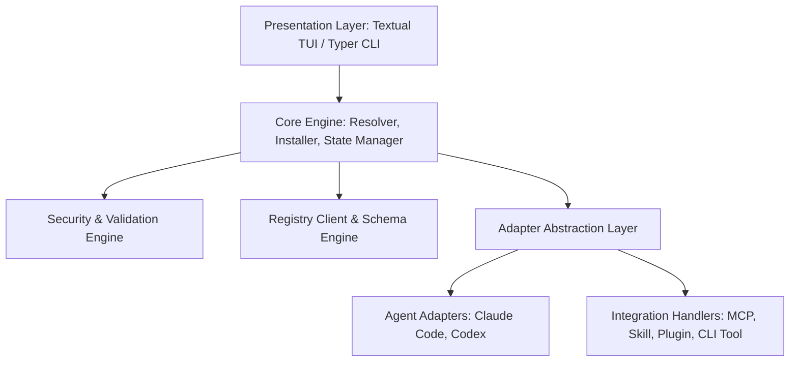
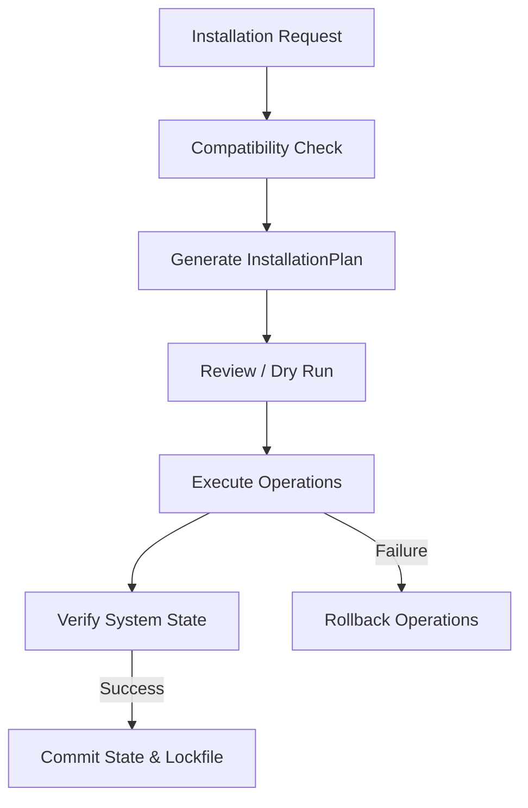

# Technical Architecture & Implementation Plan: AI Add-ons Manager (`aiaddons`)

## 1. Recommended Project Architecture

The application uses a **Hexagonal / Layered Architecture** with a Domain-Driven Core. This keeps core business logic (compatibility checking, dependency resolution engine, security verification, and transactional installation) decoupled from presentation interfaces (TUI & CLI) and third-party agent/file system implementations.



### Core Architecture Layers:
1. **Domain Models & Rules (`core/`)**: Pure Python representations of Integrations, Manifests, Agents, Local State, and Compatibility constraints.
2. **Registry & Security (`registry/`)**: Remote fetching, local caching, JSON schema verification, executable whitelisting, and cryptographic checksum validation.
3. **Target Adapters (`agents/`)**: Agent detection logic and config file managers for Claude Code and Codex.
4. **Integration Handlers (`integrations/`)**: Type-specific logic to process MCP configs, deploy Agent Skills, handle Plugins, or link CLI tools.
5. **Transactional Installation Engine (`installer/`)**: Reversible execution pipeline (`InstallPlan` with `RollbackStack`) ensuring atomic installs/uninstalls.
6. **Presentation Layer (`tui/`, `cli/`)**: Rich TUI interface (via Textual) and headless scripting interface (via Typer).

---

## 2. Folder Structure

We adopt the standard **`src/` layout** (PEP 621) with `hatchling` as the build backend.

```text
aiaddons/
├── pyproject.toml
├── README.md
├── LICENSE
├── docs/
│   └── ARCHITECTURE.md
├── tests/
│   ├── unit/
│   │   ├── test_compatibility.py
│   │   ├── test_security.py
│   │   ├── test_mcp_handler.py
│   │   └── test_claude_adapter.py
│   ├── integration/
│   │   └── test_installer_pipeline.py
│   └── fixtures/
│       └── sample_registry.json
└── src/
    └── aiaddons/
        ├── __init__.py
        ├── __main__.py
        ├── cli/                   # Typer CLI Entrypoints
        │   ├── main.py
        │   └── commands/          # list, install, remove, update, doctor, search
        ├── tui/                   # Textual Interactive Terminal UI
        │   ├── app.py
        │   ├── screens/           # BrowserScreen, DetailScreen, HealthScreen
        │   └── widgets/           # IntegrationCard, AgentSelector, SearchBar, StatusFooter
        ├── core/                  # Domain Models & Business Logic
        │   ├── models/            # Pydantic Schemas (Integration, Agent, State)
        │   ├── resolver.py        # SemVer & Compatibility Resolver
        │   └── installer.py       # Transactional Installation Pipeline
        ├── agents/                # Agent Detection & Adapter Implementations
        │   ├── base.py            # BaseAgentAdapter protocol
        │   ├── claude_code.py     # Claude Code Detector & Config Manager
        │   └── codex.py           # OpenAI Codex Detector & Config Manager
        ├── integrations/          # Integration Handlers
        │   ├── base.py            # BaseIntegrationHandler protocol
        │   ├── mcp.py             # MCP Server Config Handler
        │   ├── skill.py           # Agent Skill File Deployer
        │   ├── plugin.py          # Composite Plugin/Add-on Handler
        │   └── cli_tool.py        # External CLI Tool Dependency Linker
        ├── registry/              # Registry & Validation Engine
        │   ├── client.py          # HTTP Registry Fetcher with Cache
        │   ├── schema.py          # Pydantic & JSON Schema Validator
        │   └── security.py        # Command Sanitizer, Whitelist & Checksum Engine
        └── state/                 # Local State & Lockfile Management
            ├── store.py           # Installed State Store (~/.aiaddons/state.json)
            └── lockfile.py        # Workspace Lockfile Handler (aiaddons.lock)
```

---

## 3. Python Technology Stack

- **Python Version**: Python 3.11+ (modern async, improved performance, native typing).
- **TUI Framework**: [`Textual`](https://textual.textualize.io/) (modern async TUI framework built on Rich; supports full keyboard/mouse control, CSS-like styling, reactive UI widgets, and checkbox lists).
- **CLI Framework**: [`Typer`](https://typer.tiangolo.com/) + [`Rich`](https://rich.readthedocs.io/) (for headless command execution and formatted terminal output).
- **Data Validation & Modeling**: [`Pydantic v2`](https://docs.pydantic.dev/) (fast Rust-backed validation and strict typing for registry schemas and configs).
- **HTTP Client**: [`httpx`](https://www.python-httpx.org/) (async HTTP client with connection pooling, retries, and timeout controls).
- **Version & SemVer Management**: [`packaging`](https://packaging.pypa.io/) (standard library for parsing agent/Python version specifiers).
- **Build Backend**: `hatchling` (PEP 517 standard build system).

---

## 4. Agent Abstraction for Claude Code and Codex

All target AI agents implement a common abstract interface:

```python
class BaseAgentAdapter(Protocol):
    id: str           # e.g., "claude-code", "codex"
    name: str         # e.g., "Claude Code", "OpenAI Codex"
    
    def detect(self) -> AgentDetectionResult: ...
    def get_config_path(self, scope: Scope) -> Path: ...
    def supports_integration(self, integration_type: IntegrationType) -> bool: ...
    def install_mcp(self, spec: MCPSpec, scope: Scope) -> None: ...
    def install_skill(self, skill_dir: Path, scope: Scope) -> None: ...
    def remove_integration(self, integration_id: str, scope: Scope) -> None: ...
```

### Claude Code Adapter (`ClaudeCodeAdapter`):
- **Detection**: Checks for `claude` executable in `PATH` and existence of `~/.claude.json` or `.claude/`.
- **MCP Config**: Reads/writes `mcpServers` object in `~/.claude.json` (Global) or project `.claude.json` (Workspace).
- **Skill Path**: Installs skills to `~/.claude/skills/` (Global) or `.claude/skills/` (Workspace).

### Codex Adapter (`CodexAdapter`):
- **Detection**: Checks for `codex` binary in `PATH` and existence of `~/.codex/` directory.
- **MCP Config**: Reads/writes `mcpServers` in `~/.codex/config.json` or equivalent agent configuration file.
- **Skill Path**: Installs skills to `~/.agents/skills/` (Workspace) or global agent directory.

---

## 5. Registry Architecture

The registry is **declarative and metadata-driven**:

1. **Remote Index**: A static JSON manifest hosted on a CDN or GitHub Pages (`https://registry.aiaddons.dev/index.json`).
2. **Local Caching**: Registry indexes are cached locally (`~/.cache/aiaddons/registry.json`) with configurable TTL (e.g., 24 hours) and force refresh support (`aiaddons registry refresh` / `--refresh` flag).
3. **Custom Registry Support**: Users can add private or internal company registries via `aiaddons registry add <url_or_path>`.
4. **Lazy Loading**: The primary index contains essential metadata (ID, name, category, summary, compatibility). Complete handler specifications are fetched on demand when inspecting or installing.

---

## 6. Registry Schema

Every integration is validated against a strict Pydantic model (`IntegrationManifest`) with `extra = "forbid"` configuration:

```yaml
id: github-mcp
name: GitHub MCP Server
version: 1.2.0
description: Model Context Protocol server for searching code, managing PRs, and inspecting issues.
documentation_url: https://github.com/modelcontextprotocol/servers
license: MIT
category: developer-tools
integration_type: mcp
target_agents:
  - claude-code
  - codex
supported_scopes:
  - global
  - workspace
source:
  source_type: package
  package_name: "@modelcontextprotocol/server-github"
  checksum: "sha256:e3b0c44298fc1c149afbf4c8996fb92427ae41e4649b934ca495991b7852b855"
dependencies:
  - name: npx
    type: cli
    required: true
trust:
  verification_status: verified
  publisher:
    name: Model Context Protocol Team
    url: https://github.com/modelcontextprotocol
    declared_verified: true
  allowed_executables:
    - npx
tags:
  - github
  - mcp
  - git
handler_spec:
  mcp:
    transport: stdio
    runtime: npx
    package_name: "@modelcontextprotocol/server-github"
    env_vars:
      - name: GITHUB_PERSONAL_ACCESS_TOKEN
        required: true
        secret: true
        description: GitHub PAT with repo access
```

---

## 7. MCP Integration Architecture

- **Handler**: `MCPIntegrationHandler`.
- **Behavior**: Instead of executing MCP servers directly, `aiaddons` acts as a configuration builder.
- **Workflow**:
  1. Parses the MCP handler spec from the registry.
  2. Prompts the user (via secure TUI modal or CLI prompt) for required environment variables (e.g., API keys).
  3. Formats and safely injects the server definition into the target agent's config file (e.g., `~/.claude.json` under `mcpServers`).
  4. Manages cleanup by removing the entry on uninstallation.

---

## 8. Skills Integration Architecture

- **Handler**: `SkillIntegrationHandler`.
- **Behavior**: Downloads or extracts an Agent Skill bundle (containing `SKILL.md` and optional supporting assets).
- **Workflow**:
  1. Validates the `SKILL.md` frontmatter and metadata.
  2. Verifies that the skill structure complies with target agent specifications.
  3. Deploys the skill files into the agent's designated skill directory (`~/.claude/skills/<skill-id>` or `.agents/skills/<skill-id>`).
  4. Tracks deployed files in local state for clean removal.

---

## 9. Plugin/Add-on Architecture

- **Handler**: `PluginIntegrationHandler`.
- **Behavior**: Handles composite packages that include a combination of MCP servers, skills, and CLI dependencies.
- **Workflow**:
  1. Breaks the plugin into sub-component installation tasks.
  2. Executes child tasks within a single composite transaction.
  3. Ensures all sub-components are active or rolls back the entire installation if any component fails.

---

## 10. Installation Engine Architecture (Phase 5A)

The installation engine uses a **Declarative & Transactional Plan Execution** architecture. The core principle is that the registry describes **WHAT** an integration is, while trusted application code determines **HOW** it is installed. Metadata never directly executes commands.



### 10.1 Installation Pipeline
1. **Request Ingestion**: Takes `IntegrationManifest`, `AgentDetectionResult`, and requested `Scope`.
2. **Compatibility Evaluation**: `CompatibilityEngine` verifies target agent support, scope support, capabilities, and dependencies.
3. **Plan Generation**: Type-specific installer (`MCPInstaller`, `SkillInstaller`, `PluginInstaller`, `CLIToolInstaller`) constructs an `InstallationPlan`.
4. **Safety & Path Traversal Verification**: `plan.validate_safety()` enforces strict operation-level path validation, target root boundaries, MCP package sanitization, environment variable restrictions, configuration scope protection, and rollback metadata safety.
5. **Dry Run / Review**: `aiaddons install <addon-id> --dry-run` displays planned changes without mutating filesystem or agent configurations.
6. **Transactional Execution (Phase 5B)**: Atomic step execution with rollback tracking.

### 10.2 Installation Plan Model (`InstallationPlan`)
The `InstallationPlan` model is an immutable representation of planned operations:
- `addon_id`, `addon_name`, `addon_version`: Identifies the target add-on.
- `target_agent`, `target_agent_name`: Target AI coding agent (e.g. `claude-code`, `codex`).
- `target_scope`: `global` or `workspace`.
- `integration_type`: `mcp`, `skill`, `plugin`, or `cli_tool`.
- `source`: Source specification metadata (`SourceSpec`).
- `planned_operations`: List of declarative, typed operation models (`BaseOperation`).
- `dependencies`: Evaluated dependency check results.
- `warnings`: Operational or trust warnings.
- `risk_level`: Severity rating (`LOW`, `MEDIUM`, `HIGH`).
- `reversible`: Boolean indicating if all planned operations support rollback.
- `rollback_info`: `RollbackMetadata` containing explicit inverse operations.

### 10.3 Declarative Operation Model & Security Guarantees
Operations represent high-level structural intent rather than arbitrary shell execution. Generic command operations (e.g., `ExecuteCommand`, `ShellCommand`, `RunScript`) are strictly forbidden.

#### Security Guarantees:
- **Mandatory Target Root & Boundary Confinement**: Every operation requires an explicit `target_root`. Future execution engines MUST canonicalize paths (`resolved_root = Path(target_root).resolve()`, `resolved_dest = (resolved_root / destination).resolve()`) and reject any operation if `resolved_dest` is outside `resolved_root`.
- **Operation-Level Path Validation**: All operation path fields (`directory_path`, `destination_path`, `file_path`, `config_path`, `destination_dir`) reject `..` traversal sequences, POSIX absolute paths, Windows drive letters, UNC network paths, URL-encoded traversal, and null bytes.
- **Typed Execution Payloads**: Operations contain complete execution payloads (`content: str` in `WriteFileOperation`, `value: Any` in `ModifyJsonOperation`/`ModifyYamlOperation`) rather than summaries alone.
- **MCP Package Sanitization**: `AddMcpServerOperation.package_name` enforces strict package-name regex formatting, prohibiting argument-injection vectors (leading `-`), whitespace, shell metacharacters, or path separators.
- **Environment Variable Restrictions**: `env_var_names` enforces valid identifier syntax (`[A-Za-z_][A-Za-z0-9_]*`) and blocks dangerous process manipulation variables (`LD_PRELOAD`, `PYTHONPATH`, `NODE_OPTIONS`, `PATH`, etc.).
- **Configuration Scope Protection**: `ModifyJsonOperation` and `ModifyYamlOperation` block modifications to sensitive root agent configuration keys (`permissions`, `allow_all`, `security`, `telemetry`, `auto_approve`, `hooks`, `trust`).
- **Comprehensive Rollback Safety**: `InstallationPlan.validate_safety()` validates both `planned_operations` AND `rollback_info.rollback_operations` for path traversal and shell safety.

Supported typed operations:
- **`CreateDirectoryOperation`**: Ensures target skill or plugin directories exist within `target_root`.
- **`CopyFileOperation`**: Copies asset bundles safely.
- **`WriteFileOperation`**: Writes structured configuration or skill definitions containing explicit `content`.
- **`ModifyJsonOperation`**: Safely updates JSON configuration files (e.g. `mcpServers` in `~/.claude.json`) with strongly typed `value` payloads.
- **`ModifyYamlOperation`**: Safely updates YAML configurations with strongly typed `value` payloads.
- **`AddMcpServerOperation`**: Registers MCP server parameters (`runtime`, `package_name`, `transport`, `env_var_names`).
- **`AddSkillOperation`**: Deploys skill markdown instructions (`SKILL.md`) and supporting files.
- **`AddPluginReferenceOperation`**: Registers composite plugin component references.

### 10.4 Transaction Model & Rollback Strategy
Each installation is represented by an `InstallationTransaction` tracking transaction state through phases:
`REQUESTED` → `COMPATIBILITY_CHECKED` → `PLANNED` → `REVIEWED` → `EXECUTING` → `VERIFIED` → `COMMITTED`.

If an error occurs during execution, the transaction transitions to `FAILED` and triggers `RollbackMetadata.rollback_operations` in reverse sequence to restore host system state. All rollback operations are validated against the same security guardrails as forward operations.

### 10.5 Dry-Run Architecture
The CLI supports `aiaddons install <addon-id> --dry-run`:
- Loads manifest metadata.
- Performs agent detection and compatibility evaluation.
- Generates the complete `InstallationPlan`.
- Displays formatted steps in terminal without modifying configuration, downloading packages, making network calls, or launching subprocesses.
- Running without `--dry-run` reports: `"Real installation is not implemented yet. Use --dry-run."`

### 10.6 Secure External Package Execution Architecture (Phase 5B.2)
The external package execution layer (`src/aiaddons/core/execution/external/`) provides a secure, trusted execution engine for package manager operations (`npx`, `uvx`, `pip`, `npm`, `git`, `python`, `node`) required by typed installation plans.

#### Architectural Principles:
1. **Registry Metadata vs Application Execution**: Registry metadata describes **WHAT** (e.g. package `@modelcontextprotocol/server-github`), while trusted application code determines **HOW** it is executed. Metadata never supplies raw command strings.
2. **Strict Executable Allowlist**: Only pre-approved runtime binaries (`npx`, `uvx`, `pip`, `npm`, `git`, `python`, `node`) are permitted. Resolves executable binaries dynamically via `shutil.which` and validates that the resolved binary matches the allowlist.
3. **No Shell Invocations (`shell=False`)**: Processes are executed strictly using argument vectors (`list[str]`) passed directly to `subprocess.Popen` with `shell=False`. Neither `cmd.exe /c`, `powershell -Command`, `bash -c`, nor `shell=True` are ever used.
4. **Windows Compatibility**: On Windows, `shutil.which` resolves native `.cmd` or `.exe` launchers (e.g. `npx.cmd`, `pip.exe`, `git.exe`) safely without launching intermediary shell wrappers.
5. **Argument & Package Sanitization**: Every argument in a command vector is validated to reject null bytes (`\0`), shell metacharacters (`;&||><$\``), inline code evaluation flags (`--eval`, `-e`, `-c`), path traversal, and command injection attempts. Package names are validated against strict regex rules.
6. **Environment Isolation & Secret Protection**: Custom environment variables are validated to prevent overriding restricted process manipulation variables (`LD_PRELOAD`, `PYTHONPATH`, `NODE_OPTIONS`, `PATH`, etc.). Secrets are automatically masked as `***MASKED***` in stdout, stderr, and log output.
7. **Timeout Enforcement**: Process execution enforces an explicit timeout (default 120 seconds). Processes exceeding timeout are forcibly terminated (`proc.kill()`) and raise `ProcessTimeoutError`.
8. **Dry-Run Integrity Guarantee**: Under `--dry-run`, `ExternalRunner.execute()` simulates execution and returns a dry-run result with zero subprocess invocations, zero network calls, and zero filesystem mutations.
9. **Transaction & Rollback Integration**: Integrated with `InstallationTransaction` state transitions (`REQUESTED` → `EXECUTING` → `VERIFIED` → `COMMITTED`, or `FAILED` → `ROLLED_BACK`). External package installations that cannot be undone automatically without host side-effects are represented explicitly as non-reversible steps.

---

## 11. Compatibility System

The `CompatibilityResolver` evaluates constraints before any action is taken:

1. **Agent Version Check**: Parses agent binaries and compares versions against requirements using `packaging.specifiers.SpecifierSet`.
2. **OS & Arch Check**: Verifies `sys.platform` against target manifest constraints.
3. **Dependency Runtime Check**: Verifies existence of required binaries on the host system (`npx`, `uvx`, `python`, `git`, `node`) using `shutil.which`.
4. **Conflict Resolution**: Detects naming collisions or conflicting MCP server configurations.

If any check fails, the TUI displays an explicit "Incompatible" badge detailing missing prerequisites.

---

## 12. Local State Management

- **Central Installed State**: Maintained at `~/.aiaddons/installed_state.json` (Windows: `%APPDATA%/aiaddons/installed_state.json`).
- **State Schema**: Tracks installed integration ID, version, target agent, installation scope, timestamp, installed files, and configured MCP keys.
- **Workspace Lockfile (`aiaddons.lock`)**: Created in project roots when workspace scope is used. Allows teams to check in `aiaddons.lock` so developers can run `aiaddons sync` to mirror identical integrations.

---

## 13. Security Model & Architecture Boundaries

Security is fundamental to `aiaddons`. The application prevents arbitrary command execution from remote registry manifests using strict architecture boundaries:

1. **No Generic Command Operations**: The operation model does not support `ExecuteCommand`, `ShellCommand`, or `RunScript`. All operations are strictly typed domain models.
2. **No `shell=True` Executions**: Any future subprocess invocations use strict argument vectors (`subprocess.run(["npx", "-y", ...])`), preventing shell injection attacks.
3. **Strict Binary Whitelist**: Only pre-approved runtime binaries (`npx`, `uvx`, `python`, `node`, `pip`, `git`) listed in `allowed_executables` are allowed. Unapproved executables are rejected.
4. **No Shell Metacharacters**: String fields in manifests and operations are scanned against `FORBIDDEN_SHELL_PATTERNS` (`;&||><$\``). Any match raises `SecurityValidationError`.
5. **Path Traversal Protection**: All relative paths are validated against `validate_safe_relative_path` to prevent path traversal outside designated target root directories.
6. **Dry-Run Isolation**: Dry-run plan generation makes no network calls, modifies no configuration files, and executes no subprocesses.
7. **Cryptographic Integrity**: Downloads (zip bundles, release archives) are validated against SHA-256 checksums published in the signed registry index.
8. **Secret Protection**: Sensitive environment keys (e.g., API tokens) are flagged as `secret: true`, masked in logs/UI, and stored securely.

---

## 14. CLI & TUI Design

### TUI Design (`aiaddons`):
Built with **Textual**:
- **Sidebar**: Agent selector (All, Claude Code, Codex), Category filter (DevTools, Database, Web, Workflow), Install Status filter (All, Installed, Updates).
- **Main View**: Interactive table/list of integrations with checkboxes for batch operations.
- **Detail Panel**: Description, publisher verification badge, required permissions, and compatibility details.
- **Status & Action Footer**: Keyboard shortcuts (`[Space]` Select, `[I]` Install, `[R]` Remove, `[U]` Update, `[D]` Health Check, `[/]` Search, `[Q]` Quit).

```text
┌────────────────────────────────────────────────────────────────────────────────────────────────────────┐
│ AI Add-ons Manager v0.1.0                                                     [Agent: Claude Code  ▼] │
├─────────────────┬──────────────────────────────────────────────────────────────────────────────────────┤
│ CATEGORIES      │ [ ] INTEGRATION              TYPE      CATEGORY       COMPATIBILITY   STATUS         │
│ ► All           │ ─── ──────────────────────── ───────── ────────────── ─────────────── ────────────── │
│   DevTools      │ [x] github-mcp-server        MCP       DevTools       ✓ Compatible    [Installed]    │
│   Database      │ [x] postgres-mcp             MCP       Database       ✓ Compatible    [Update Avail] │
│   Web           │ [ ] brave-search-mcp         MCP       Web            ✓ Compatible    [Not Installed]│
│   Workflow      │ [ ] refactoring-skill        Skill     Workflow       ✓ Compatible    [Not Installed]│
├─────────────────┴──────────────────────────────────────────────────────────────────────────────────────┤
│ DETAIL: postgres-mcp (v1.1.0) by Model Context Protocol Team [Verified]                                │
│ Allows AI agent to query database schemas, inspect tables, and safely execute read-only queries.       │
├────────────────────────────────────────────────────────────────────────────────────────────────────────┤
│ [Space] Toggle  [I] Install (2)  [R] Remove  [U] Update  [D] Doctor  [/] Search  [Q] Quit              │
└────────────────────────────────────────────────────────────────────────────────────────────────────────┘
```

### Non-Interactive CLI Commands:
- `aiaddons list [--installed] [--agent <agent>]`
- `aiaddons search <query>`
- `aiaddons install <id> [--scope global|workspace]`
- `aiaddons remove <id>`
- `aiaddons update [--all]`
- `aiaddons doctor`
- `aiaddons registry [list|add|refresh]`

---

## 15. Testing Strategy

1. **Unit Tests (`pytest`)**:
   - Pydantic schema validation for registry manifests.
   - Compatibility solver (SemVer logic and OS matching).
   - Command security sanitizer and metacharacter rejector.
   - JSON config diff generator.
2. **Mock Adapters**:
   - System calls (`shutil.which`, `subprocess.run`) mocked using `pytest` fixtures.
   - Isolated file system testing using `tmp_path`.
3. **TUI Tests**:
   - Automated TUI behavior testing using `Textual`'s built-in `App.run_test()` pilot driver.
4. **Integration Tests**:
   - End-to-end dry-run testing of the installation pipeline against dummy agent config files in isolated temporary directories.

---

## 16. Development Phases

| Phase | Focus | Key Deliverables |
|-------|-------|------------------|
| **Phase 1** | Core Foundation & Data Models | `pyproject.toml`, directory structure, Pydantic schemas, Registry client, Security sanitizer, State store |
| **Phase 2** | Agent & Integration Adapters | `ClaudeCodeAdapter`, `CodexAdapter`, `MCPIntegrationHandler`, `SkillIntegrationHandler` |
| **Phase 3** | Transactional Installation Engine | `InstallPlan`, `RollbackStack`, `CompatibilityResolver` |
| **Phase 4** | Typer CLI Commands | Headless CLI commands (`install`, `list`, `remove`, `search`) |
| **Phase 5** | Textual TUI Interface | Interactive TUI app with filtering, multi-select checkboxes, search, and detail modal |
| **Phase 6** | Health Check & Polish | `aiaddons doctor`, test suite coverage, error handling, documentation |

---

## 17. V1 vs V2 Scope

### V1 Scope (In-Scope):
- Supported Agents: **Claude Code** and **Codex**.
- Integration Types: **MCP**, **Skills**, **Plugins**, **CLI Tools**.
- Architecture: **Registry-driven** (JSON metadata schema, non-hardcoded logic).
- UI: Interactive **Textual TUI** + headless **Typer CLI**.
- Security: Command sanitization, executable whitelist, SHA-256 verification.
- Transactional Install/Uninstall/Update engine with rollback support.
- Local state management (`installed_state.json` & `aiaddons.lock`).
- `aiaddons doctor` health check command.

### V2 Scope (Future):
- Support for additional agents (Cursor, Windsurf, Gemini CLI, Aider).
- Remote registry publishing CLI workflow (`aiaddons publish`).
- Containerized/Sandboxed execution runner (Docker / Wasm for MCP servers).
- Dependency resolution graph between skills and plugins.

---

## Exact First Implementation Task Recommendation

Start with **Task 1: Core Foundation & Package Setup**:

1. Create `pyproject.toml` configuring `hatchling` as the build backend and declaring key dependencies (`typer`, `rich`, `textual`, `pydantic`, `httpx`, `packaging`).
2. Create the package directory structure inside `src/aiaddons/`.
3. Implement the core Pydantic domain schemas in `src/aiaddons/core/models/manifest.py` (`IntegrationManifest`, `AgentDetectionResult`, `RegistryIndex`).
